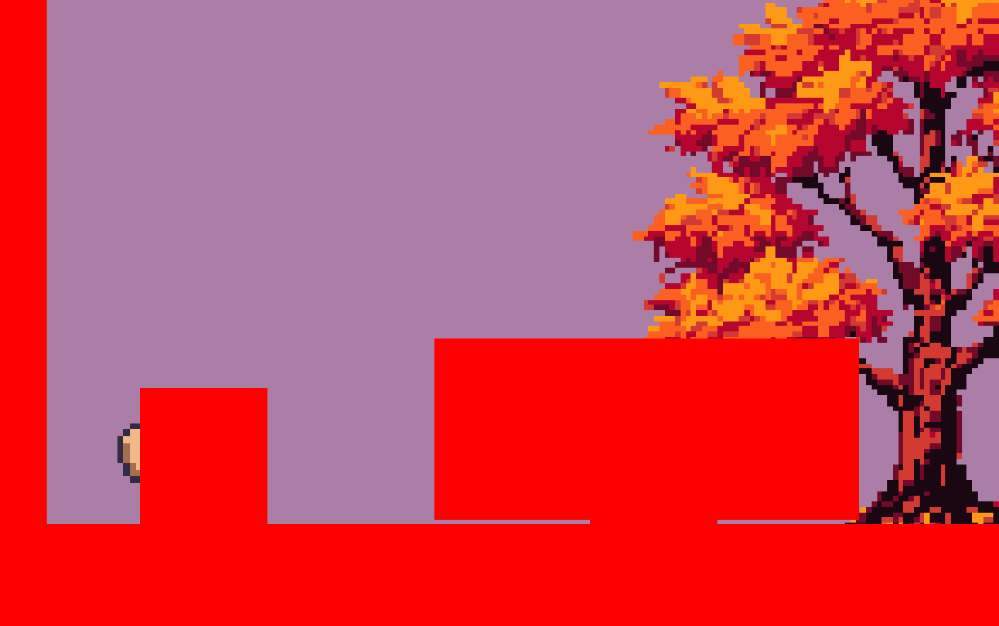
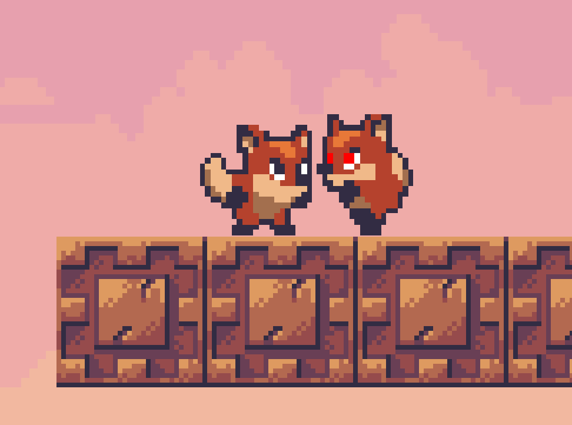

**Python version: 3.12**
[A guide to install python3.12 on Linux](https://medium.com/@donfiealex/getting-python-3-12-up-and-running-on-ubuntu-and-debian-servers-cbe557d7d368)

**How to setup a virtual environment**:

```console
// create a virtual environment under a folder named 'venv'
$ python3.12 -m venv venv
// activate the venv (command for Linux, Windows' command for activation might differ)
$ source ./venv/bin/activate
```

**Required packages installation**: `pip3.12 install -r requirements.txt`

**How to run**: `python3.12 src/Game.py`

**Helpful info**:

- python3.12 venv (if not installed): `sudo apt install python3.12-venv`
- if you face an error: `AttributeError: module 'pkgutil' has no attribute 'ImpImporter'. Did you mean: 'zipimporter'?`, try `python3.12 -m pip install --upgrade setuptools`

**If you have Python < 3.12**

- switch to the branch `master-python-3.10`
- if you will copy some code from this file while doing tasks, remove all `@override` statements from that code

**How to generate a level**: see `python src/level_editor/level_generator.py`

**TASKS**

1.  Creating the `Enemy` class and placing an enemy on the level

    - Copy the file [src/actors/characters/Fox.py](src/actors/characters/Fox.py) into [src/actors/characters/enemy](src/actors/characters/enemy) dir and rename it into `Enemy.py`, also rename the class `Fox` into `Enemy` in the new file
    - The enemy should use animation sprites provided under [assets/sprites/enemy](assets/sprites/enemy)
    - Place 1 enemy on the Level1 on `PLAYABLEGROUND` (see [src/levels/level1/Level1.py](src/levels/level1/Level1.py)) at position (500, 500)
    - Take a screenshot of the game for UPEL where the enemy can be seen on the screen

2.  Adding a non-physical collision component to the `Enemy` class

    - uncomment [src/actors/characters/enemy/PlayerDetectorComponent.py](src/actors/characters/enemy/PlayerDetectorComponent.py)
    - inside of the `Enemy` `__init__` add a `PlayerDetectorComponent` instance to `self.components`. Keep in mind to import the `PlayerDetectorComponent` class at the end of the file to prevent circular import issue
    - in [src/constants.py](src/constants.py) you can set `SHOW_COLLISIONS` to `True` to see collision boxes on the screen when the game is running
    - set width and relative offset of the `PlayerDetectorComponent` so that it's at the center of the enemy and it's wide - something like this (if it takes too much time see the end of the README file):
      
    - take a similar screenshot for UPEL

3.  Making the enemy chase the player if the player gets close

    - copy the following overridden methods into the `PlayerDetectorComponent.py`:

    ```python
    @override
    def tick(self):
        super().tick()

    @override
    def check_and_process_collision(self, other: CollisionComponent):
        super().check_and_process_collision(other)
    ```

    - add next 2 lines into the `__init__` of the `PlayerDetectorComponent`:

    ```python
    self.collided_player_this_tick: bool = False
    self.collided_player_position: Vector = Vector(0, 0)
    ```

    - write a logic so that in the `check_and_process_collision` method we check if the instance of the `other.owned_by` is `Player.PlayerCharacter` and if the `other` is colliding `self`
        Hints: 
        - use Python's `isinstance` function 
        - use `colliderect`, example is also provided in the [src/components/CharacterCollisionComponent.py](src/components/CharacterCollisionComponent.py)
    
        If both conditions are `True` then set `self.collided_player_this_tick` to `True` and `self.collided_player_position` to the current position of the `other.owned_by`

    - write a logic so that in the `tick` method we check if `self.collided_player_this_tick` is `True` then we use `self.owned_by.movement_component.set_x_direction` method so that the enemy goes in the direction of the player (based on their positions). Otherwise, set the x direction to 0 so that the enemy doesn't move. Don't forget to reset the `collided_player_this_tick` to `False` at the end of the 
    `tick` method
        Hint: use `int(some_number)` to convert `float` to `int` 

    - send a screenshot to UPEL where the enemy is running in the direction of the player like this:
      

4. Reload the level if the enemy collides with the player:


PlayerDetectorComponent width and offset respectively are: 300; (-80. 20)
